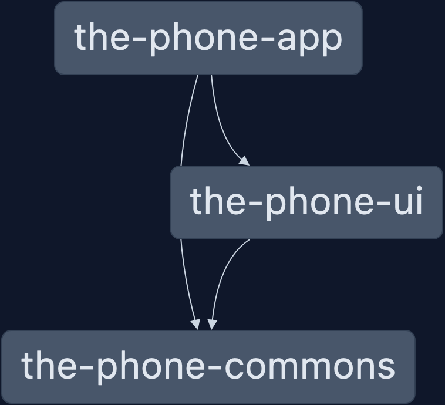

# ThePhoneReact

## Identificación

Author: Vladimir Bataller Rodríguez [vladimirbat at Git](https://github.com/vladimirbat).
Repository: [https://github.com/vladimirbat/the-phone-react](https://github.com/vladimirbat/the-phone-react).
Type: POC - Experimental.
Deployment Site: https://the-phone-react.vercel.app/
## Introducción

Esta es una pequeña aplicación de ejemplo en React que simula una tienda de teléfonos móviles.

Las principales características técnicas del proyecto son:

- Monorepo creado con [Nx](https://nx.dev/).
- El monorepo contiene una biblioteca de componentes (UI-kit o Design System) y la aplicación principal (SPA) ambas implementadas en React.
- Se emplean componentes funcionales de React (con Hooks), implementados con JSX y TypeScript.
- Se accede a un API propia (desarrollada en el repositorio de GitHub [the-phone-api](https://github.com/vladimirbat/the-phone-api) del autor). Esta API está desarrollada con funciones serverless de Vercel y está desplegada en esa plataforma ([ver the-phone-api desplegada en Vercel](https://the-phone-api.vercel.app/)).
- Para la estilización se emplea una arquitectura Sass 7+1 simplificada por la sencillez del proyecto y se emplean [CSS Custom Properties](https://developer.mozilla.org/en-US/docs/Web/CSS/Using_CSS_custom_properties) para dejar abierta la puerta a un mantenimiento basado en Design Tokens y la posibilidad de implementar varios temas de estilo.
- Para la construcción del proyecto se ha empleado Vite en lugar de Webpack, con lo que se consiguen mejoras en los tiempos de desarrollo en local, construcción y CI.
- Este proyecto se deplegará en la plataforma Vercel para que pueda probarse su funcionamiento sin necesidad de instalarlo en local ([ver el proyecto desplegado en plataforma Vercel](https://the-phone-react.vercel.app/)).
- La carga de páginas se realiza en modo Lazy, pero en lugar de usar React.lazy y React.Suspense, se emplea la biblioteca ['@loadable/component'](https://github.com/gregberge/loadable-components).
...
## Para ejecutar este proyecto en local
---
- En primer lugar se deben instalar las dependencias: `npm install`.
- Y luego, se debe ejecutar `npm start` y abrir una ventana del navegador en [http://localhost:4200/](http://localhost:4200/).

## Ver las dependencias entre la aplicación y la biblioteca
---
Ejecutar `nx graph` lo cual abrirá una ventana del navegador.

   
  Dependencias entre proyectos del monorepo

## Avance de tareas
---

### Leyenda

| Simbolo | Significado |
|-----|-------------------|
| [x] | Tarea completada  |
| **WIP** | Tarea en proceso  |
| [ ] | Tarea pendiente   |

### Tareas

- [x] Creación de BBDD para almacenar información de los teléfonos/dispositivos disponibles en la tienda de moviles para ser consumidad desde API (the-phone-api).
- [x] Implementación y despliegue en Vercel del proyecto del API (the-phone-api).
- [x] Creación de monorepo con proyectos React de bibliotecas y aplicación principal (SPA).
- [x] Inclusión del Lazy Loading.
- [x] Maquetación del listado de dispositivos.
- [x] Llamada al API para listado por defecto de dispositivos.
- [x] Maquetación de la cabecera de la aplicación.
- [x] Configuración de assets de la aplicación.
- [x] Scroll virtual del listado de dispositivos.
- [x] Maquetación de campos del buscador de dispositivos e implementación de su lógica.
- [x] Sistema de persistencia de datos en el frontend.
- **WIP** Vista del detalle de un dispositivo (queda ajustar maquetación y navegación al carrito).
- **WIP** Página de resumen del carrito de la compra.
- [ ] API de seguimiento de sesión y almacenamiento del carrito.
- [x] Icono del carrito de la compra (muestra número de productos en la cesta).
- [ ] Refactorizar arq. hexagonal en el frontend.
- [ ] Incluir inversify en arq hexagonal.
- [ ] Agregar acción prepush para ejecutar tsc antes de subir cambios.
- [ ] Implementar testing.

